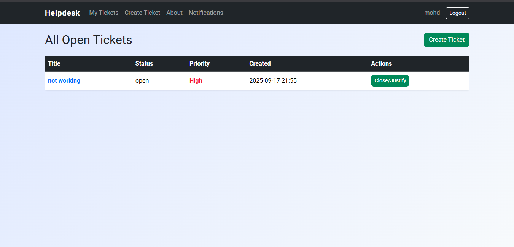
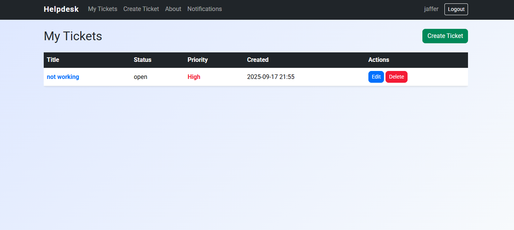

# IT Help Desk Ticketing System

A Django-based ticketing system for managing IT support requests. Users can log in, create, track, and resolve IT tickets.


## MY Teckits Screen for Helper



## MY Teckits Screen for Staff




## Features
- Custom user model with roles: Staff and Helper
- User authentication (login, logout, signup)
- Profile page for editing username, gender, and birth date
- Create, read, update, and delete (CRUD) tickets
- Ticket statuses: Open, Closed
- Ticket priority: High, Medium, Low (helpers see prioritized list)
- Ticket justification and rating system
- Notification system with unread badge and notifications page
- Staff can edit/delete their own tickets; helpers can close/justify tickets
- Responsive, modern UI with Bootstrap
- About page


## Tech Stack
- Python 3
- Django
- SQLite (development) / PostgreSQL (production)


## Project Structure

```
IT-Helpdesk-Ticketing-System/
│   manage.py
│   README.md
│   db.sqlite3
│   HELP desk ERD.PNG
│
├── helpdesk/
│   ├── __init__.py
│   ├── asgi.py
│   ├── settings.py
│   ├── urls.py
│   └── wsgi.py
│
├── tickets/
│   ├── __init__.py
│   ├── admin.py
│   ├── apps.py
│   ├── forms.py
│   ├── forms_profile.py
│   ├── models.py
│   ├── tests.py
│   ├── urls.py
│   ├── views.py
│   ├── static/
│   │   ├── css/
│   │   │   └── base.css
│   │   └── tickets/
│   │       ├── css/
│   │       │   └── style.css
│   │       └── images/
│   │           ├── header-logo.svg
│   │           ├── My_teckits_screen_Helper.PNG
│   │           └── My_teckits_screen_Staff.PNG
│   └── templates/
│       ├── about.html
│       ├── base.html
│       ├── home.html
│       ├── signup.html
│       └── tickets/
│           ├── base.html
│           ├── notifications.html
│           ├── profile.html
│           ├── ticket_confirm_delete.html
│           ├── ticket_detail.html
│           ├── ticket_form.html
│           ├── ticket_justify.html
│           └── ticket_list.html
│
├── venv/ (virtual environment)
└── .git/ (if using git)
```


## Author

This project was developed by mohdaaj and contributors.


